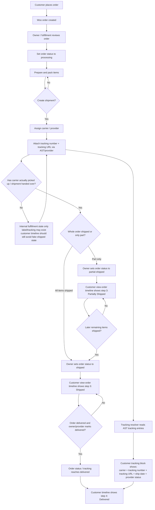
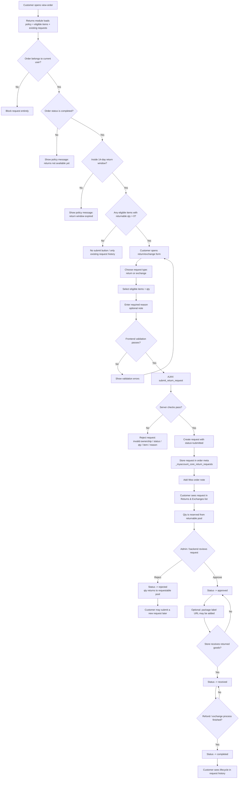

# My Account Core — Shipping & Returns Flows

Ban nay gom 2 flow diagram:
- `Owner ship order` theo logic hien tai
- `Return / exchange` theo logic hien tai + business rules dang chot

## 1) Owner ship order flow

### Tom tat logic hien tai

- `store owner` la nguoi control `order status`
- `shipping provider / AST` cung cap `tracking data`
- timeline tren `view-order` uu tien di theo `order status`
- tracking block tren `view-order` di theo `tracking entries`
- `partial shipped` va `shipped` cung nam o step 3 cua timeline
- `label created` khong phai customer-facing main status

### Flow

### Rang buoc nghiep vu quan trong

- `tracking data != order status`
- `shipment exists` khong tu dong co nghia la `order da shipped`
- `partial shipped` la trang thai cap `order`, khong phai bat buoc cap `shipment`
- `timeline = order-level story`
- `tracking block = shipment-level detail`
- AST free co the co tracking nhung khong dam bao full shipment workflow editor

## 2) Return / exchange flow

### Tom tat logic hien tai

- customer chi tao `request`, khong tu dong refund/exchange xong
- diem vao customer-facing la `view-order`
- chi order `completed` moi duoc request theo default policy
- default `return window = 14 ngay`
- moc tinh window: `date_completed`, fallback `date_paid`, fallback `date_created`
- chi item con `returnable quantity` moi duoc request
- quantity da nam trong request `submitted/approved/received/completed` deu bi giu cho
- request `rejected` moi tra quantity ve lai pool

### Flow

### Rang buoc nghiep vu quan trong

- request types hien tai: `return`, `exchange`
- request status hien tai: `submitted`, `approved`, `rejected`, `received`, `completed`
- request moi tao khong tu dong tao `refund`
- `completed` la ket thuc customer-facing workflow, khong ep phai map 1-1 voi refund engine
- `approved` co the co `package_label`, nhung doc business rule hien tai van xem day la optional / future-friendly

## 3) File draw.io di kem

Mo file:
- `wp-content/plugins/myaccount-core/docs/ORDER_SHIPPING_AND_RETURNS_FLOWS.drawio`
