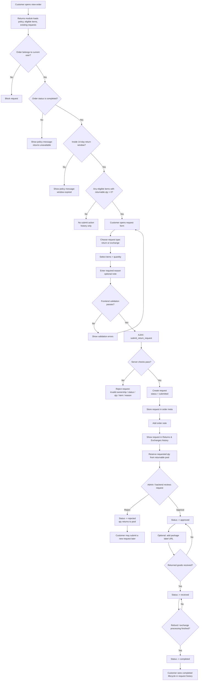

# Return / Exchange Flow

Flow nay mo ta qua trinh `return and exchange` theo logic hien tai cua `myaccount-core`.

## Tom tat rule dang ap dung

- customer tao `request` tren `view-order`
- request type ho tro:
  - `return`
  - `exchange`
- chi duoc gui request khi:
  - user so huu order
  - order status la `completed`
  - con trong `14 ngay`
  - item con `returnable quantity`
- status hien tai cua request:
  - `submitted`
  - `approved`
  - `rejected`
  - `received`
  - `completed`
- chi `rejected` moi tra quantity ve pool requestable

## Flow diagram

## Ghi chu nghiep vu

- request moi tao khong tu dong tao `refund`
- `approved` chua co nghia la refund/exchange da xong
- `completed` la diem ket thuc customer-facing cua workflow
- `package label` hien co trong data model admin update, nhung la optional

## File draw.io di kem

Mo file:
- `wp-content/plugins/myaccount-core/docs/RETURN_EXCHANGE_FLOW.drawio`
